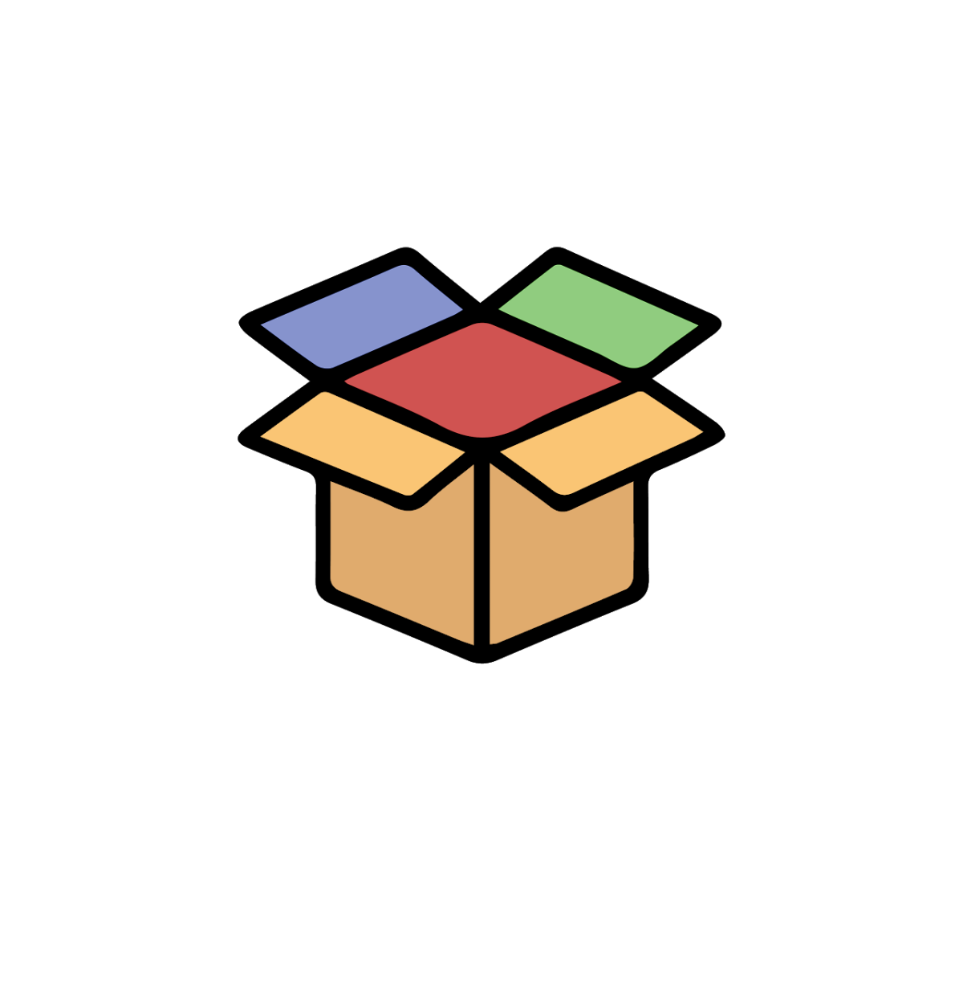
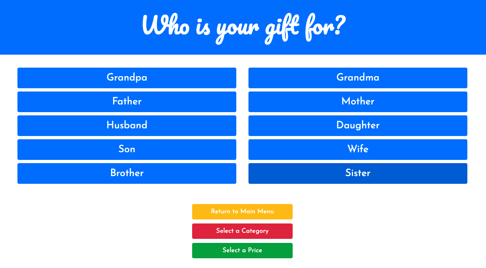
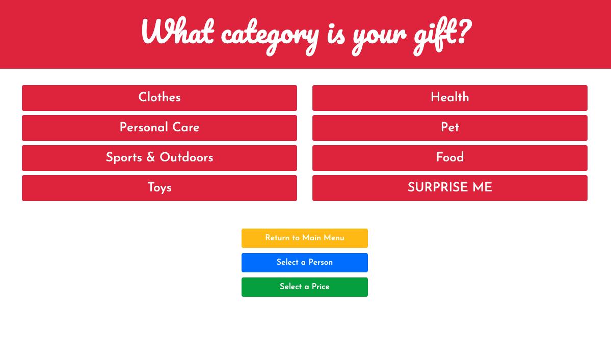
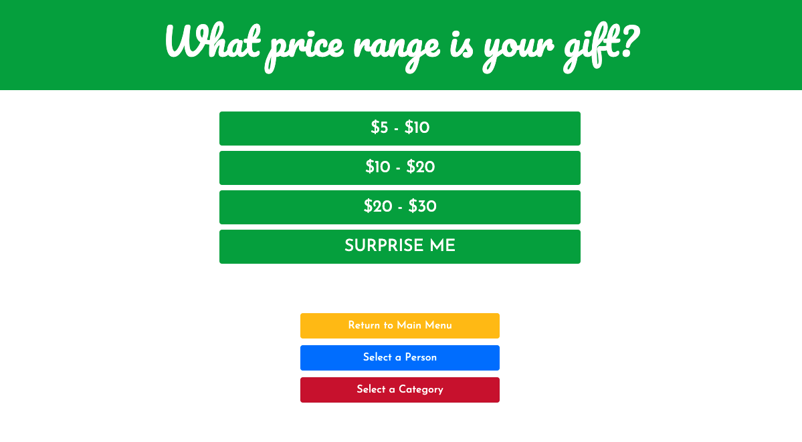

# Oh-My-Gift 

OMG! We are glad that you can make it. Have you procrastinated on getting a gift for an upcoming Birthday, Anniversary, Wedding, Funeral, Bar mitzvah...(etc), and are in need of a gift idea, but have absolutely no idea what to buy?  Well we got you covered. Head on over to (*https://peaceful-depths-70768.herokuapp.com/) 

## Table of Contents 

* [Description](#description)

* [Technologies](#technologies)

* [Usage](#usage)

* [Contributing](#contributing)

## Description

Oh-My-Gift is a "find a gift" application that assist Users to find the perfect gift for that special someone for that special something. The User is first presented with a dynamic home page where they will be able to select who the gift is for, what category would they like the gift to be as well as a price range. As they select the options they will be presented with a list from which they can choose from. If they make a mistake, NO NEED TO WORRY simply click from the 3 options to go back to a specific section or just return to main menu. As a User selects the data is stored into local storage where the information is collected for the specific query from a Walmart Product List database. Once the User has selected the person, category and price - they will be presented with a list of options that correspond with their specific selections. 

## Technologies
- HTML
- CSS
- JavaScript
- Jquery
- MySQL
- Sequelize
- Handlebars

## Usage

  
## Contributing

* [Anthony Loredo](https://github.com/anthonyloredo5)

* [Sofia Mantas](https://github.com/Sofoula23)

* [Leandro Parrado](https://github.com/Bokosyk)

* [Joseph Laro](https://github.com/JRLaro)

> MIT License

Copyright (©) 2020, Oh-My-Gift

Permission is hereby granted, free of charge, to any person obtaining a copy of this software and associated documentation files (the "Software"), to deal in the Software without restriction, including without limitation the rights to use, copy, modify, merge, publish, distribute, sublicense, and/or sell copies of the Software, and to permit persons to whom the Software is furnished to do so, subject to the following conditions:

The above copyright notice and this permission notice shall be included in all copies or substantial portions of the Software.

THE SOFTWARE IS PROVIDED "AS IS", WITHOUT WARRANTY OF ANY KIND, EXPRESS OR IMPLIED, INCLUDING BUT NOT LIMITED TO THE WARRANTIES OF MERCHANTABILITY, FITNESS FOR A PARTICULAR PURPOSE AND NONINFRINGEMENT. IN NO EVENT SHALL THE AUTHORS OR COPYRIGHT HOLDERS BE LIABLE FOR ANY CLAIM, DAMAGES OR OTHER LIABILITY, WHETHER IN AN ACTION OF CONTRACT, TORT OR OTHERWISE, ARISING FROM, OUT OF OR IN CONNECTION WITH THE SOFTWARE OR THE USE OR OTHER DEALINGS IN THE SOFTWARE.

